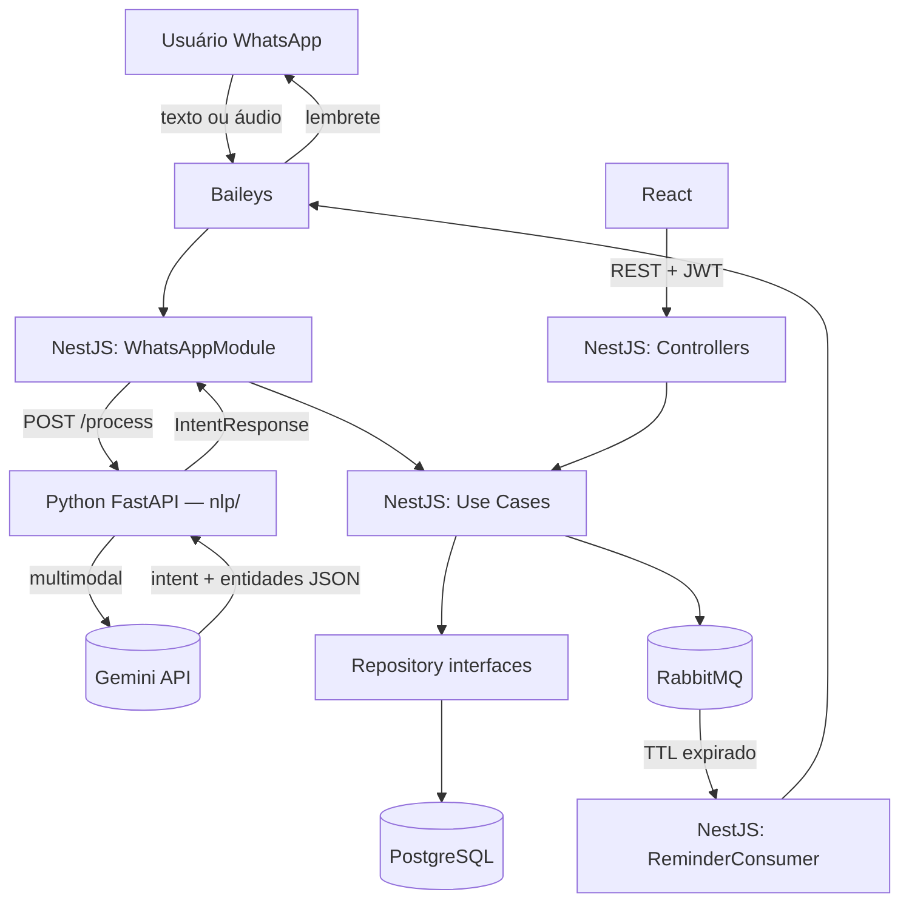

# ZapAgenda — Arquitetura

## Stack

| Componente | Tecnologia |
|---|---|
| Back-end API | NestJS (TypeScript) — Clean Architecture |
| NLP / IA | Python 3.12 + FastAPI |
| Front-end | React + Vite (TypeScript) |
| Banco | PostgreSQL 15 |
| Mensageria | RabbitMQ 3 |
| WhatsApp | Baileys (@whiskeysockets/baileys) |
| IA / NLP | Gemini API (free tier) |
| Auth | JWT + Refresh Token |
| ORM | TypeORM |
| Estado React | Zustand |
| HTTP Client | Axios + TanStack Query |
| Deploy back | Home server — Docker + Watchtower |
| Deploy front | Vercel |

---

## Diagrama de fluxo



---

## Estrutura de pastas

```
ZapAgenda/
├── api/                         ← NestJS (Clean Architecture)
│   └── src/
│       ├── domain/
│       │   ├── entities/        ← regras de negócio puras (sem decorators de framework)
│       │   ├── repositories/    ← interfaces de repositório (contratos)
│       │   └── exceptions/      ← hierarquia de exceções de domínio
│       ├── application/
│       │   ├── use-cases/       ← um arquivo por caso de uso
│       │   └── dtos/
│       ├── infrastructure/
│       │   ├── persistence/     ← TypeORM: entidades ORM + implementações dos repos
│       │   ├── queue/           ← RabbitMQ producers e consumers
│       │   └── auth/            ← JWT strategy, guards, bcrypt
│       └── presentation/
│           ├── controllers/
│           ├── modules/         ← NestJS modules (DI wiring)
│           └── filters/         ← GlobalExceptionFilter + ErrorResponse
├── nlp/                         ← Python FastAPI (interno, sem exposição externa)
│   ├── app/
│   │   ├── routers/
│   │   ├── services/
│   │   │   ├── gemini.py        ← Strategy: IGeminiClient
│   │   │   ├── fsm.py           ← FSM de estados da conversa
│   │   │   └── session.py       ← sessões em memória (dict por JID)
│   │   ├── models/              ← Pydantic schemas (request/response)
│   │   └── main.py
│   ├── tests/
│   ├── pyproject.toml
│   └── Dockerfile
├── web/                         ← React + Vite (TypeScript)
│   ├── src/
│   │   ├── pages/
│   │   ├── components/
│   │   ├── store/               ← Zustand
│   │   ├── services/            ← Axios + TanStack Query
│   │   └── types/
│   └── Dockerfile
├── docs/
├── docker-compose.yml           ← desenvolvimento local
├── docker-compose.prod.yml      ← produção
└── .env.example
```

---

## Contrato NestJS ↔ Python NLP

```
POST http://nlp:8000/process

Body:
{
  "jid": "5511999999999@s.whatsapp.net",
  "text": "marca dentista sexta às 15h",
  "audio_base64": null,
  "history": [
    { "role": "user", "content": "oi" },
    { "role": "bot", "content": "Olá! Como posso ajudar?" }
  ]
}

Response:
{
  "intent": "create_appointment",
  "entities": {
    "title": "dentista",
    "date": "2026-05-29",
    "time": "15:00",
    "category": null
  },
  "reply_text": "Vou marcar dentista sexta às 15h. Confirma?",
  "needs_confirmation": true,
  "session_state": "awaiting_confirmation"
}
```

---

## Modelo de dados

```
User
- id            uuid PK
- email         string unique
- password_hash string

Category
- id                       uuid PK
- name                     string
- color                    string (hex)
- default_reminder_minutes int nullable
- is_system                boolean

Appointment
- id              uuid PK
- title           string
- description     string nullable
- start_time      timestamptz
- end_time        timestamptz nullable
- category_id     FK → Category
- is_recurring    boolean
- recurrence_rule enum(daily, weekly, monthly) nullable
- is_cancelled    boolean default false
- created_via     enum(whatsapp, dashboard)
- created_at      timestamptz
- updated_at      timestamptz

Reminder
- id             uuid PK
- appointment_id FK → Appointment
- minutes_before int
- status         enum(pending, sent, failed)
- scheduled_for  timestamptz
- sent_at        timestamptz nullable
```

---

## Endpoints da API REST

```
POST   /auth/login
POST   /auth/refresh

GET    /appointments?start=&end=&category=
GET    /appointments/:id
POST   /appointments
PATCH  /appointments/:id
DELETE /appointments/:id

GET    /categories
POST   /categories
PATCH  /categories/:id
DELETE /categories/:id

GET    /appointments/:id/reminders
POST   /appointments/:id/reminders
DELETE /appointments/:id/reminders/:reminderId

GET    /settings
PATCH  /settings
```

---

## Telas React

| Tela | Responsabilidade |
|---|---|
| LoginPage | Formulário de login |
| CalendarPage | Calendário mês/semana/dia |
| AppointmentsPage | Lista com filtros |
| AppointmentModal | Formulário criar/editar |
| AnalyticsPage | Gráficos por categoria |
| SettingsPage | Categorias e lembretes padrão |

---

## Design patterns por serviço

### NestJS (`api/`)
| Pattern | Onde |
|---|---|
| Repository | `domain/repositories/` (interface) + `infrastructure/persistence/` (impl) |
| Use Case | `application/use-cases/` — um arquivo por operação |
| Strategy | `NlpClientService` com interface — permite trocar o Python por outro provider |
| Factory | `domain/entities/` — métodos estáticos `create()` com validação de invariantes |
| Template Method | Use cases de recursos com dono comum (ex: `OwnedResourceUseCase`) |

### Python (`nlp/`)
| Pattern | Onde |
|---|---|
| Strategy | `IGeminiClient` — permite trocar de modelo sem alterar FSM |
| FSM | `fsm.py` — `idle → awaiting_clarification → awaiting_confirmation → idle` |

---

## Deploy

| Serviço | Onde | Como |
|---|---|---|
| `api/` + `nlp/` | Home server | docker-compose.prod.yml + Watchtower |
| `web/` | Vercel | Push → build automático |

O `nlp/` não tem porta exposta no host — comunicação exclusiva via rede interna do Compose.

---

## Decisões técnicas

| Decisão | Escolha | Motivo |
|---|---|---|
| WhatsApp | Baileys | Sem Puppeteer, leve, sem display — único client Node.js maduro |
| IA | Gemini free tier | Multimodal nativo (texto + áudio em uma chamada); sem custo |
| NLP em Python | FastAPI | Ecossistema de IA nativo; Pydantic para validar output do Gemini |
| Sessão de conversa | Em memória (Python) | Single-user pessoal; não precisa sobreviver a restart |
| Mensageria | RabbitMQ | TTL nativo para lembretes sem cron |
| ORM | TypeORM | Padrão NestJS |
| Estrutura NestJS | Clean Architecture | Separação Domain/Application/Infrastructure/Presentation |
| Deploy front | Vercel | Zero-config para React/Vite |
| Deploy back | Home server + Watchtower | Infraestrutura já existente |
| Fuso | America/Sao_Paulo fixo | Uso pessoal, sem multi-timezone |
