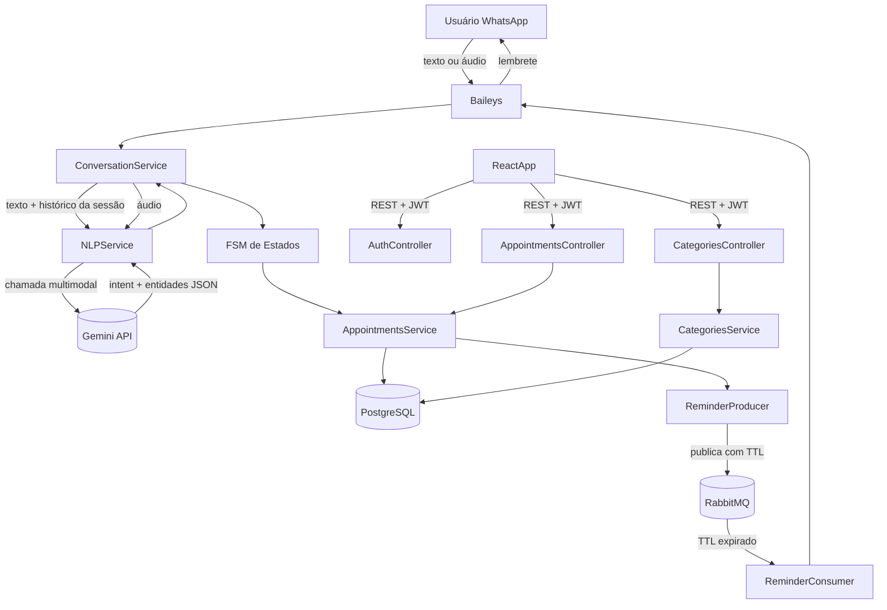

# ZapZap — Arquitetura

## Stack

| Componente | Tecnologia |
|---|---|
| Back-end | NestJS (TypeScript) |
| Front-end | React + Vite (TypeScript) |
| Banco | PostgreSQL 15 |
| Mensageria | RabbitMQ 3 |
| WhatsApp | Baileys (@whiskeysockets/baileys) |
| IA / NLP | Gemini API (free tier) |
| Auth | JWT + Refresh Token |
| ORM | TypeORM |
| Estado React | Zustand |
| HTTP Client | Axios + TanStack Query |
| Deploy | Docker + Watchtower + GitHub Actions |

---

## Diagrama de fluxo



---

## Estrutura de módulos NestJS

```
api/src/
├── modules/
│   ├── auth/                  ← login, JWT guard, refresh token
│   ├── appointments/          ← CRUD de compromissos
│   ├── categories/            ← CRUD de categorias
│   ├── reminders/             ← configuração de lembretes por compromisso
│   ├── whatsapp/              ← integração Baileys (envio e recebimento)
│   ├── conversation/          ← FSM + sessões de conversa
│   └── nlp/                   ← integração Gemini (texto e áudio)
├── queue/
│   ├── producers/             ← ReminderProducer
│   └── consumers/             ← ReminderConsumer
├── common/
│   ├── exceptions/            ← hierarquia de exceções
│   └── filters/               ← GlobalExceptionFilter
├── config/
└── main.ts
```

---

## Modelo de dados

```
User
- id           uuid PK
- email        string unique
- password_hash string

Category
- id                       uuid PK
- name                     string
- color                    string (hex)
- default_reminder_minutes int nullable
- is_system                boolean  ← categorias padrão não deletáveis

Appointment
- id              uuid PK
- title           string
- description     string nullable
- start_time      timestamptz
- end_time        timestamptz nullable
- category_id     FK → Category
- is_recurring    boolean
- recurrence_rule enum(daily, weekly, monthly) nullable
- is_cancelled    boolean default false
- created_via     enum(whatsapp, dashboard)
- created_at      timestamptz
- updated_at      timestamptz

Reminder
- id            uuid PK
- appointment_id FK → Appointment
- minutes_before int
- status         enum(pending, sent, failed)
- scheduled_for  timestamptz
- sent_at        timestamptz nullable

ConversationSession
- id            uuid PK
- whatsapp_jid  string unique
- state         enum(idle, awaiting_clarification, awaiting_confirmation)
- context       jsonb  ← dados parciais do compromisso em construção
- history       jsonb  ← últimas N mensagens para contexto da IA
- expires_at    timestamptz
- updated_at    timestamptz
```

---

## Endpoints da API REST

```
POST   /auth/login
POST   /auth/refresh

GET    /appointments?start=&end=&category=
GET    /appointments/:id
POST   /appointments
PATCH  /appointments/:id
DELETE /appointments/:id

GET    /categories
POST   /categories
PATCH  /categories/:id
DELETE /categories/:id

GET    /appointments/:id/reminders
POST   /appointments/:id/reminders
DELETE /appointments/:id/reminders/:reminderId

GET    /settings
PATCH  /settings
```

---

## Telas React

| Tela | Responsabilidade |
|---|---|
| LoginPage | Formulário de login |
| CalendarPage | Calendário mês/semana/dia |
| AppointmentsPage | Lista com filtros |
| AppointmentModal | Formulário criar/editar (usado em ambas as telas) |
| AnalyticsPage | Gráficos de uso por categoria |
| SettingsPage | Categorias e lembretes padrão |

---

## Decisões técnicas

| Decisão | Escolha | Motivo |
|---|---|---|
| WhatsApp client | Baileys | Sem puppeteer, leve, adequado para servidor sem display |
| IA | Gemini free tier | Multimodal nativo — texto e áudio em uma chamada; sem custo |
| Mensageria | RabbitMQ | TTL nativo para lembretes sem cron; Kafka já está no portfólio |
| ORM | TypeORM | Stack padrão NestJS do projeto |
| Estrutura | Monorepo (api/ + web/) | Projeto pessoal — uma repo, mais simples de gerenciar |
| Estado React | Zustand | Leve, sem boilerplate do Redux |
| HTTP client | Axios + TanStack Query | Cache nativo, loading/error states declarativos |
| Fuso | America/Sao_Paulo fixo | Uso pessoal, sem necessidade de multi-timezone |
